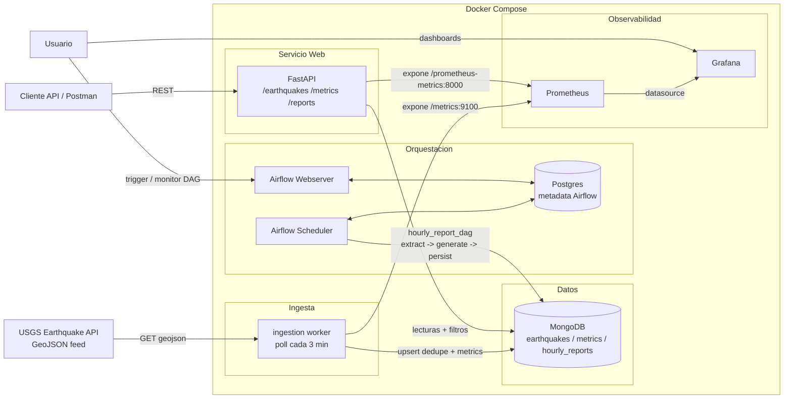

# Arquitectura

## Diagrama de componentes y flujo de datos

## Flujo de un evento

1. **Ingesta** (`src/ingestion/worker.py`): cada 180s consulta el feed de USGS, transforma cada
   feature válido (`src/services/processing_service.py`) y hace upsert en `earthquakes` con dedupe
   por índice único en `event_id` (`src/database/repositories.py::EarthquakeRepository.upsert`).
2. **Procesamiento en tiempo real**: por cada evento *nuevo* (no duplicado), `metrics_service`
   actualiza atómicamente (`$inc`/`$max`) el documento de métricas de la ventana horaria
   correspondiente en la colección `metrics`.
3. **Exposición**: la API lee directamente de Mongo con filtros/paginación/orden; las lecturas
   agregadas (`/metrics`, `/reports`) pasan por una caché TTL en memoria.
4. **Reporte horario**: Airflow ejecuta `hourly_report_dag` cada hora, lee los eventos de la última
   hora, calcula los agregados y los persiste en `hourly_reports`, consumible luego vía `/reports`.
5. **Observabilidad**: tanto el worker de ingesta como la API exponen métricas Prometheus; Grafana
   las visualiza en el dashboard "Quipux - Earthquakes Overview".

## Modelado de datos en MongoDB

| Colección       | Propósito                                   | Índices                                                                 |
|------------------|----------------------------------------------|--------------------------------------------------------------------------|
| `earthquakes`    | Eventos individuales normalizados            | único `event_id` (dedupe); `event_time` desc (orden/recencia); compuesto `(magnitude, event_time)` (filtros por rango) |
| `metrics`        | Agregados por ventana horaria (`YYYY-MM-DDTHH`) | único `window` (upsert atómico)                                       |
| `hourly_reports` | Reportes consolidados generados por Airflow  | `report_date` desc                                                      |

`metrics` guarda `sum_magnitude` (no `avg_magnitude`) para poder incrementar atómicamente con
`$inc` sin necesidad de leer-modificar-escribir; el promedio se calcula al servir la respuesta
(`sum_magnitude / earthquake_count`).

## Por qué no Kafka/RabbitMQ (Nivel 3) en esta entrega

El volumen de eventos del feed de USGS (decenas por hora) y la cadencia de polling (3 min) no
justifican un broker de mensajería para esta prueba; el acoplamiento ya está resuelto a nivel de
servicios (cliente → ingestion → processing → metrics, cada uno con su propia responsabilidad e
inyectado vía repositorios). Si el volumen creciera o se necesitara consumo por múltiples
suscriptores independientes, el siguiente paso natural sería publicar cada evento nuevo a un
tópico (Kafka/RabbitMQ) desde `ingestion_service` sin tocar el resto de la lógica.
